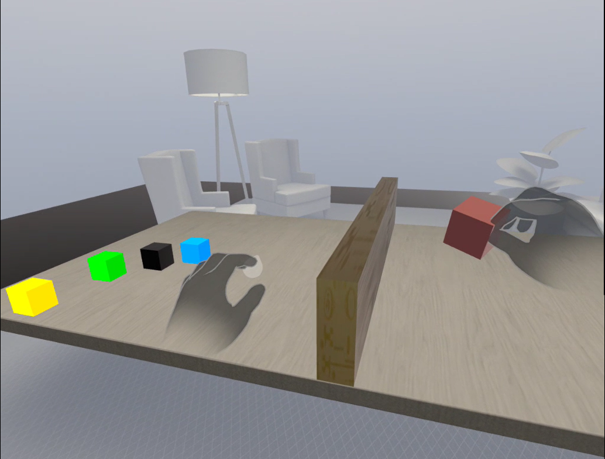

# Hand Tracking in Meta Quest 3

This VR project replicates the Block and Box neurological test for stroke patients to assess their rehabilitation progress by tracking hand movements. By replicating the test in the VR environment of Meta Quest 3, it is essential to accurately track the hand and body movements of the users.

# 1. Core Concepts

  

## 1.1. Meta XR Interaction SDK (Software Development Kit)
This VR application is developed using Unity and the [Meta XR Interaction SDK](https://developer.oculus.com/documentation/unity/unity-isdk-interaction-sdk-overview/), which facilitates immersive interactions within the virtual environment. The Interaction SDK allows users to grab and scale objects, push buttons, teleport, navigate user interfaces, and more, using either controllers or their physical hands.

## 1.2. Hand Tracking
- The hand movements of patients are tracked through the positions and rotations of their joints in 3D space. This information is accessible via [Meta’s API](https://developer.oculus.com/documentation/unity/unity-isdk-get-bone-position), which provides detailed bone data.
- The hand tracking data is then sent to the Unity Cloud platform for further processing.

# 2. Project structure

  

The left panel shows game objects with the main one is RightHandLog:

- RightHandLog: Contains the RightHandTracking.cs script, written in C#, which collects right hand joint tracking data and sends it to the Unity Cloud.
- Other game objects are available in Unity Asset Store.

